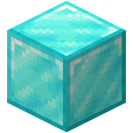

<div align="center">


# Nitro
Nitro is a fork of [Purpur](https://github.com/PurpurMC/Purpur), which focuses on optimization and more features

**Nitro is still EXPERIMENTAL phase, may or may not cause instabilities!**
</div>

## ⚙️ Features
- **Based on [Purpur](https://github.com/PurpurMC/Purpur)** - Adds a high customization level to your server
- **Parallel World Ticking** - Leverage multiple CPU cores for world processing
- **Linear Region File Format** - Optimize your world with the old V1/V2 linear format
- **Fully Compatible** - Works seamlessly with Bukkit, Spigot and Paper plugins
<!-- - **Reduction in network-related load** - 20% reduction and 97% reduction in Packet-Per-Second -->
- **Most Pufferfish Patches** - For the good performance

*...and some more*

## 📦 Building and setting up
Run the following commands in the root directory:

```bash
> ./gradlew applyAllPatches              # apply all patches
> ./gradlew createMojmapPaperclipJar     # build the server jar
```

## ⚖️ License
Nitro is licensed under the GNU General Public License v3.0. You can find the license [here](LICENSE).

## 📜 Credits
Nitro includes patches and features from other projects, and without these projects, Nitro wouldn't exist today. Here is the list of projects that Nitro takes patches from:

- [Purpur](https://github.com/PurpurMC/Purpur)
- [Leaves](https://github.com/LeavesMC/Leaves)
- [SparklyPaper](https://github.com/SparklyPower/SparklyPaper)
- [Leaf](https://github.com/Winds-Studio/Leaf)
- [C2ME](https://github.com/RelativityMC/C2ME-fabric)
- [DivineMC](https://github.com/BX-Team/DivineMC)
- [Pufferfish](https://github.com/pufferfish-gg/Pufferfish)
- [Horizon](https://github.com/GideonWhite1029/Horizon)
- [PulseMC](https://github.com/Pulse-MC/Pulse-Paper)


